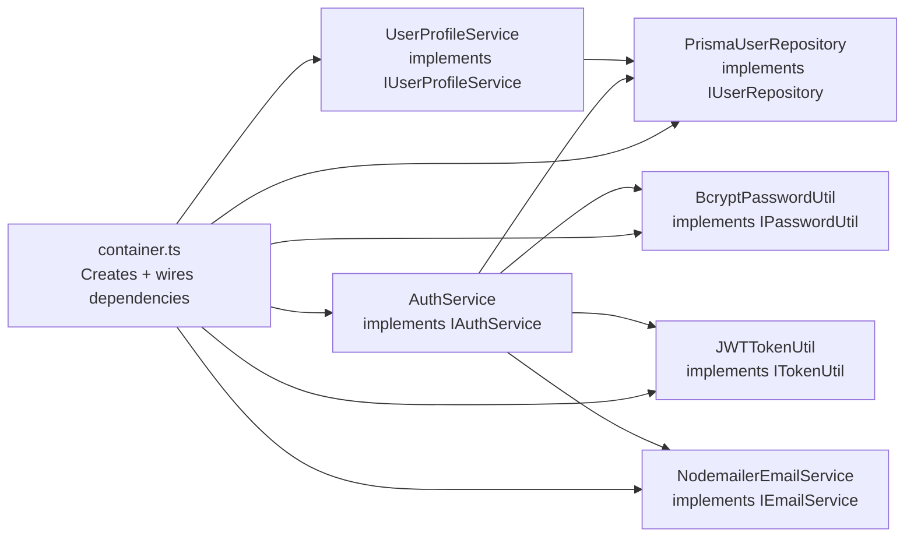
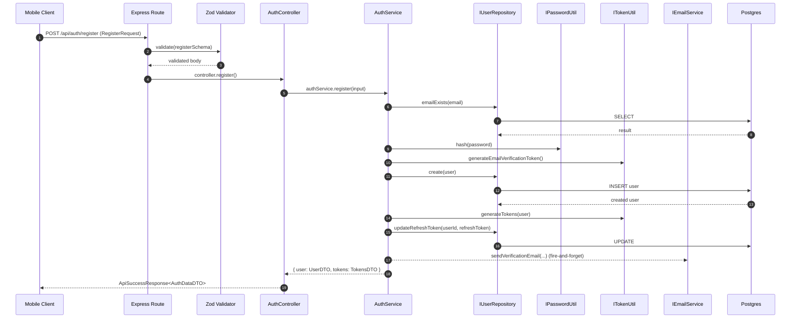
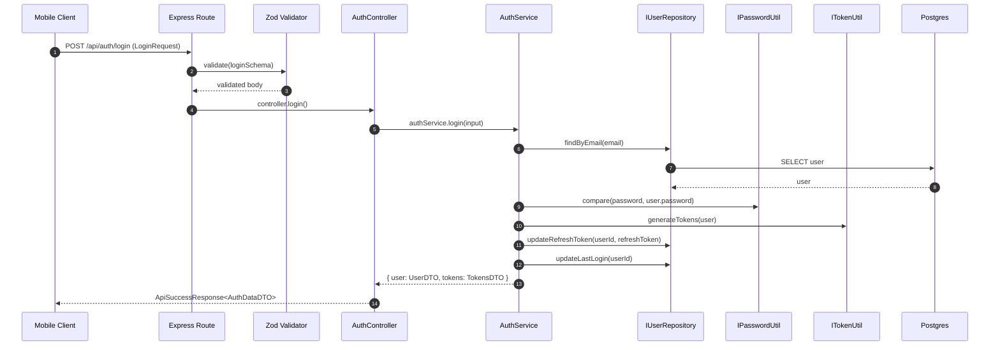
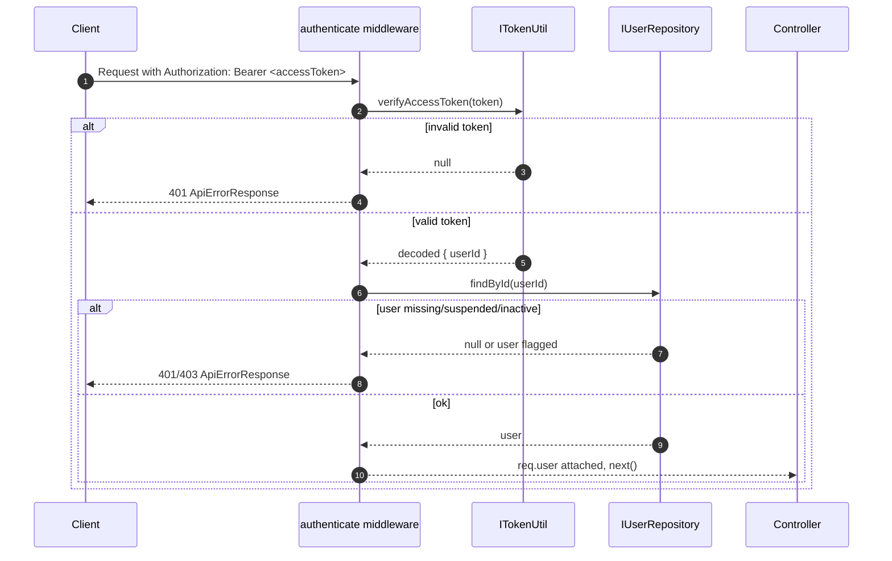
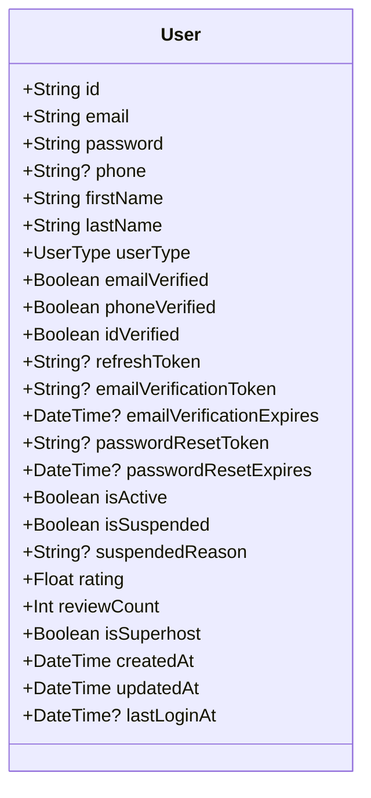

# ParkingPal — App Architecture & How It Works

This document explains how the ParkingPal app is structured and how data flows through the system.

It covers:
- **Mobile app** (`/mobile`) — React Native (Expo) UI + local state
- **Backend API** (`/parkingpal-backend`) — Node.js/Express + Prisma/Postgres + Auth
- **Shared Types** (`/shared-types`) — the **contract** between frontend and backend

---

## Repo Structure (Monorepo)

```text
parkingPal/
├── mobile/                 # React Native (Expo) app
├── parkingpal-backend/     # Node.js + Express API
└── shared-types/           # TypeScript API contract package (@parkingpal/shared-types)
```

### System Context Diagram

```mermaid
flowchart LR
  Mobile[Mobile App\nReact Native (Expo)] -->|HTTPS JSON| API[Backend API\nExpress + TS]
  API -->|SQL| DB[(PostgreSQL)]

  Shared[@parkingpal/shared-types\nDTOs + Requests/Responses]:::types
  Mobile -. imports .-> Shared
  API -. imports .-> Shared

  classDef types fill:#eef,stroke:#88a,stroke-width:1px;
```

**Key idea:** The mobile app and backend both import the same TypeScript types from `@parkingpal/shared-types`, so request/response shapes stay in sync.

---

## Shared Types Package (Interface Layer)

Folder: `shared-types/`

Purpose:
- Defines **DTOs** (safe data sent over the network)
- Defines request/response types for endpoints
- Standardizes API responses

Important types:
- `UserDTO`, `TokensDTO`, `AuthDataDTO`
- `RegisterRequest`, `LoginRequest`, `RefreshTokenRequest`, etc.
- `ApiSuccessResponse<T>`, `ApiErrorResponse`

Build output:
- `shared-types/dist/*` is compiled and consumed by the backend via a local file dependency.

---

## Backend Architecture (SOLID + Dependency Injection)

Backend folder: `parkingpal-backend/`

### Layered Architecture

```mermaid
flowchart TB
  subgraph HTTP[HTTP Layer]
    Routes[Routes\nExpress Router]
    Controllers[Controllers\n(Thin HTTP handlers)]
    Middleware[Middleware\n(auth, validation, rate-limit)]
  end

  subgraph CORE[Business Layer]
    Services[Services\n(Business rules)]
  end

  subgraph INFRA[Infrastructure Layer]
    Repos[Repositories\n(DB access only)]
    Utils[Utilities\n(password, jwt, mapper)]
    Email[Email Provider\n(Nodemailer)]
    Prisma[Prisma Client]
  end

  Routes --> Middleware --> Controllers --> Services --> Repos --> Prisma
  Services --> Utils
  Services --> Email
```

### Dependency Injection Container (Single Wiring Point)

File: `parkingpal-backend/src/container.ts`

This is the **only** place where concrete classes are instantiated and wired together.



**Why this matters (DIP/OCP):**
- Services depend on **interfaces**, not concrete implementations.
- To switch implementations (e.g., SendGrid instead of Nodemailer), change **one line** in `container.ts`.

---

## Backend Request Flow (Register/Login)

### Register Sequence

Endpoint: `POST /api/auth/register`



### Login Sequence

Endpoint: `POST /api/auth/login`



---

## Backend Auth Middleware Flow

Protected endpoints (e.g. `GET /api/auth/me`, `GET /api/users/profile`) use `authenticate` from the DI container.

File: `parkingpal-backend/src/middleware/authenticate.ts` (factory)



---

## Data Model (Current)

Prisma schema: `parkingpal-backend/prisma/schema.prisma`

Core entity implemented today:
- `User` (auth + verification + refresh token)

High-level model view:



### DTO Boundary (Security)

Backend **never** returns `User` directly. It always maps to `UserDTO`:
- Mapper: `parkingpal-backend/src/utils/user.mapper.ts`
- Purpose: prevent leaking `password`, `refreshToken`, reset tokens, etc.

---

## Mobile App Architecture (Current State)

Folder: `mobile/`

Key building blocks:
- **Navigation**: React Navigation (`src/navigation/*`)
- **State/Context**: `AuthContext`, `ThemeContext`, etc. (`src/contexts/*`)
- **Screens**: Auth / Renter / Host / Shared (`src/screens/*`)

### Mobile Auth Flow (Current Implementation = Mocked)

Right now, `AuthContext` uses `mockUsers` and stores a **mock token** locally:
- Secure token storage: `expo-secure-store`
- User profile storage: `AsyncStorage`

```mermaid
flowchart TB
  LoginUI[LoginScreen] --> AuthCtx[AuthContext.login()]
  AuthCtx --> Mock[mockUsers lookup]
  AuthCtx --> Secure[SecureStore authToken]
  AuthCtx --> Store[AsyncStorage user, onboarding, vehicles, payments]
  Store --> Nav[AppNavigator switches stacks]
```

**Result:** the UI flow works end-to-end for demo, but it is **not yet calling** the backend auth endpoints.

---

## Mobile ↔ Backend Integration (Planned Wiring)

When you connect mobile auth to the backend, the recommended structure is:

```mermaid
flowchart LR
  UI[Screens] --> Ctx[AuthContext]
  Ctx --> Api[authApi.ts\n(typed HTTP client)]
  Api -->|RegisterRequest/LoginRequest| Backend[/parkingpal-backend/]
  Backend -->|ApiSuccessResponse<AuthDataDTO>| Api
  Api --> Ctx
  Ctx --> UI

  Shared[@parkingpal/shared-types]:::types
  Api -. imports .-> Shared
  Backend -. imports .-> Shared

  classDef types fill:#eef,stroke:#88a,stroke-width:1px;
```

The contract types to use from `@parkingpal/shared-types`:
- `RegisterRequest`, `RegisterResponse`
- `LoginRequest`, `LoginResponse`
- `RefreshTokenRequest`, `RefreshTokenResponse`
- `ApiSuccessResponse<T>`, `ApiErrorResponse`

---

## Backend Endpoints (Auth + Profile)

Implemented today (in `parkingpal-backend/src/modules/auth/auth.routes.ts`):

### Auth
- `POST /api/auth/register`
- `POST /api/auth/login`
- `POST /api/auth/logout` (protected)
- `POST /api/auth/refresh`
- `POST /api/auth/verify-email`
- `POST /api/auth/forgot-password`
- `POST /api/auth/reset-password`
- `GET /api/auth/me` (protected)

### User Profile
- `GET /api/users/profile` (protected)
- `PUT /api/users/profile` (protected)
- `POST /api/users/verify-id` (protected, multipart upload)

---

## How to Run (Dev)

### 1) Build shared types

```bash
cd shared-types
npm install
npm run build
```

### 2) Run backend

```bash
cd parkingpal-backend
npm install
npm run prisma:generate
npm run prisma:migrate
npm run dev
```

### 3) Run mobile

```bash
cd mobile
npm install
npm run start
```

---

## Where to Look in Code

- **Shared contract**: `shared-types/src/*`
- **Backend DI wiring**: `parkingpal-backend/src/container.ts`
- **Backend auth module**:
  - `parkingpal-backend/src/modules/auth/auth.routes.ts`
  - `parkingpal-backend/src/modules/auth/auth.controller.ts`
  - `parkingpal-backend/src/modules/auth/auth.service.ts`
  - `parkingpal-backend/src/modules/auth/user-profile.*`
- **User → DTO mapping**: `parkingpal-backend/src/utils/user.mapper.ts`
- **Mobile auth + navigation**:
  - `mobile/src/contexts/AuthContext.tsx`
  - `mobile/src/navigation/AppNavigator.tsx`

